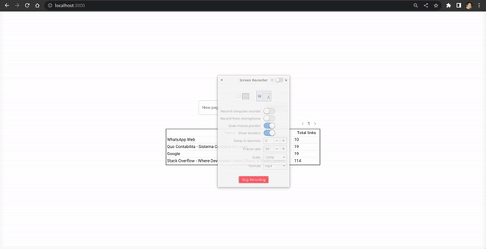

# Webscrapper

## Definition

### Summary
This is a simple application, where a user can add a link to a web page and the application will scrape all the information of that page and get a list of all of the links in that page.

### Features
- As a user, I should be able to see a list of all the pages that I have scrapped with the number of links that the scraper found.
- As a user, I should be able to see the details of all the links of a particular page, that means the url of a link and the “name” of a link.
- As a user I should be able to add a url and the system should be able to check for all the links and add it to the database. A link will have the following format `<a href="https://www.w3schools.com"> Visit W3Schools.com! </a>` the href will be the link and the body will be the name of the link.

Keep in mind that the body of a link sometimes is not only text and could be other html elements, in those cases you could save only a portion of the html. The title of the web page will be the page name. Keep in mind that some pages will take more time than others to scrape.

## Tools used

### Backend

- Python
- Django
- Django Rest Framework
- Celery
- Rabbitmq
- Beautiful soup
- SQLite

### Frontend

- React
- Nextjs
- MUI Library

## Instructions

1. `git clone <repository>`

- Dependenciies (Rabbitmq)

2. `cd webscrapper`
3. `docker-compose up`

- Backend setup

4. Create a Python virtual environment (https://docs.python.org/3/library/venv.html#creating-virtual-environments)  and enable it
5. `pip install -r requirements.txt`
6. `cd backend`
7. `python3 manage.py migrate`
8. `gunicorn --bind 0.0.0.0:5000 --timeout=300 -k gevent webscrapper.wsgi`

- Celery setup: in another terminal execute:

9. `python3 -m celery -A webscrapper worker -E -l info`

- Frontend setup: in another terminal execute:

10. `cd ..`
11. `cd frontend`
12. `npm install`
13. `npm run dev`

## Demo

